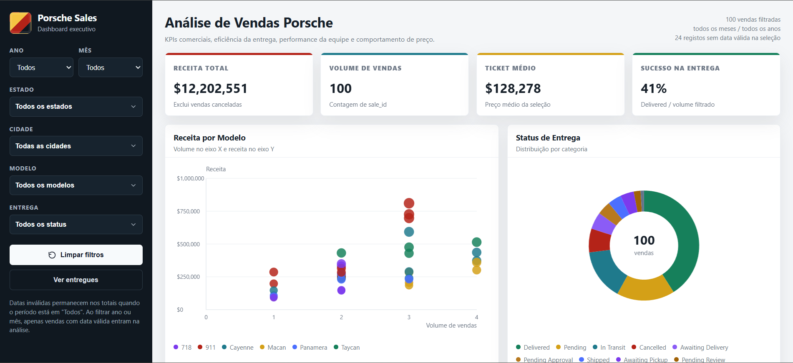

# Porsche Sales Dashboard

Dashboard interativo em HTML para análise de vendas de veículos Porsche. O projeto lê uma base Excel sanitizada, transforma os dados em JSON embutido e renderiza os indicadores e gráficos diretamente no navegador usando `<canvas>`.

## O que o dashboard mostra

- KPIs principais: receita total, volume de vendas, ticket médio e taxa de sucesso na entrega.
- Filtros laterais por ano, mês, estado, cidade, modelo e status de entrega.
- Gráficos de análise: receita por modelo, desempenho da equipe, preferências por estado, relação entre quilometragem e preço, e distribuição de status de entrega.

## Estrutura do projeto

```text
.
├── data/
│   └── dadosPorsche.xlsx
├── outputs/
│   └── porsche_sales_dashboard.html
├── work/
│   └── build_dashboard.py
└── README.md
```

- `outputs/porsche_sales_dashboard.html`: dashboard final, autocontido e pronto para abrir no navegador.
- `work/build_dashboard.py`: script que lê o Excel, normaliza os dados e gera o HTML.

## Como rodar

### Opção rápida

Abra o arquivo abaixo diretamente no navegador:

```text
outputs/porsche_sales_dashboard.html
```

Como o HTML já contém os dados embutidos, não é necessário backend nem instalação de pacotes para visualizar o dashboard.

### Servindo localmente

Também é possível servir a pasta `outputs` com Python:

```bash
python -m http.server 8765 --bind 127.0.0.1 --directory outputs
```

## Como regenerar o dashboard

Instale as dependências necessárias:

```bash
pip install pandas openpyxl
```

Depois execute:

```bash
python work/build_dashboard.py
```

Se o arquivo Excel estiver em outro caminho, ajuste a variável `INPUT_XLSX` no início de `work/build_dashboard.py`.

## Visual do dashboard


